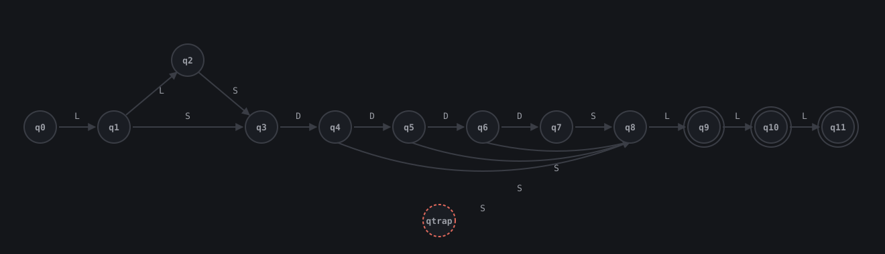

<div align="center">

# 🚗 Validator Pelat Nomor DFA

**Validasi format pelat nomor kendaraan bermotor secara otomatis menggunakan Deterministic Finite Automaton**

Aplikasi web yang memeriksa apakah susunan karakter pada sebuah pelat nomor kendaraan sudah sesuai
pola yang berlaku, dibangun di atas mesin state DFA buatan sendiri tanpa regular expression bawaan.

[](https://www.python.org/)
[](https://flask.palletsprojects.com/)
[](#-jenis-otomata-yang-diimplementasikan)
[](#-lisensi)

</div>

---

## 📖 Daftar Isi

- [Tentang Proyek](#-tentang-proyek)
- [Tampilan Aplikasi](#-tampilan-aplikasi)
- [Fitur Utama](#-fitur-utama)
- [Jenis Otomata yang Diimplementasikan](#-jenis-otomata-yang-diimplementasikan)
- [Batasan Aplikasi](#-batasan-aplikasi)
- [Tumpukan Teknologi](#-tumpukan-teknologi)
- [Struktur Folder](#-struktur-folder)
- [Instalasi & Menjalankan Aplikasi](#-instalasi--menjalankan-aplikasi)
- [Tautan Aplikasi Live & Video Presentasi](#-tautan-aplikasi-live--video-presentasi)
- [Lisensi](#-lisensi)

---

## 🎯 Tentang Proyek

**Validator Pelat Nomor DFA** adalah studi kasus penerapan Deterministic Finite Automaton (DFA) untuk
memeriksa format pelat nomor kendaraan bermotor di Indonesia: kode wilayah (1-2 huruf), nomor urut
(1-4 digit), dan huruf seri (1-3 huruf), dipisahkan spasi. Setiap karakter yang diketik pengguna
disimulasikan satu per satu lewat mesin state buatan sendiri, bukan lewat regular expression bawaan
bahasa pemrograman, sehingga proses penerimaan atau penolakannya bisa ditelusuri transisi demi transisi.

Aplikasi dibangun dengan **Flask** sebagai backend dan template Jinja2 sederhana sebagai antarmuka,
bertema gelap ala pelat kendaraan sungguhan.

---

## 🖼️ Tampilan Aplikasi

### Beranda - Form Input Pelat
Tempat mengetik pelat nomor yang ingin diuji, lengkap dengan contoh format dan arti simbol L/D/S.


### Hasil Pemeriksaan - Diterima/Ditolak
Menampilkan status sah/ditolak, penjelasan alasannya, rincian bagian pelat, jejak transisi state, dan
diagram DFA dengan jalur yang dilalui pelat tersebut disorot.


### Tentang - Cara Kerja Mesin DFA
Penjelasan definisi formal DFA, alfabet input, diagram state lengkap, serta batasan jenis pelat yang
tidak tercakup aplikasi ini.


> Simpan tangkapan layar aplikasi kamu sendiri di folder `screenshots/` dengan nama file di atas supaya
> gambarnya tampil di README ini.

---

## ✨ Fitur Utama

| Halaman | Deskripsi |
|---|---|
| 🏠 **Beranda** | Form input pelat nomor beserta penjelasan format dan alfabet L/D/S |
| ✅ **Hasil Pemeriksaan** | Status sah/ditolak, alasan detail, rincian bagian pelat, jejak transisi, dan diagram DFA interaktif |
| ℹ️ **Tentang** | Definisi formal DFA, diagram state penuh, tabel makna tiap state, dan batasan aplikasi |

### Detail fitur halaman Hasil Pemeriksaan

- ✅ Status sah/ditolak ditampilkan lebih dulu sebagai stempel, penjelasan lengkap bisa dibuka lewat tombol
- 🧭 Jejak transisi state karakter demi karakter, menunjukkan state asal dan tujuan tiap langkah
- 🗺️ Diagram DFA visual (SVG) dengan jalur yang benar-benar dilalui pelat ditandai hijau, dan jalur menuju
  state jebakan `qtrap` ditandai merah kalau pelat ditolak
- 📍 Kalau ditolak, ditunjukkan tepat di karakter ke berapa kesalahannya dan simbol apa yang seharusnya diisi
- 🧩 Kalau diterima, pelat dipecah otomatis menjadi kode wilayah, nomor urut, dan huruf seri

---

## 🧠 Jenis Otomata yang Diimplementasikan

Otomata yang digunakan adalah **DFA (Deterministic Finite Automaton)**, didefinisikan sebagai 5-tuple
`M = (Q, Σ, δ, q0, F)` dengan alfabet input yang disederhanakan menjadi tiga simbol:

- `L` untuk karakter huruf (A-Z)
- `D` untuk karakter digit (0-9)
- `S` untuk satu karakter spasi

### Diagram State



Diagram di atas dirender langsung dari data transisi yang sama persis dengan yang dipakai aplikasi, jadi
selalu sinkron dengan logika `app.py`. Versi interaktifnya, lengkap dengan highlight jalur yang dilalui
suatu pelat, bisa dilihat di halaman **Tentang** pada aplikasi yang sedang berjalan.

Keterangan tiap state:

| State | Arti | State Akhir |
|-------|------|:---:|
| q0  | Kondisi awal, belum ada karakter dibaca | - |
| q1  | Sudah membaca 1 huruf kode wilayah | - |
| q2  | Sudah membaca 2 huruf kode wilayah | - |
| q3  | Menunggu digit pertama nomor urut | - |
| q4-q7 | Sudah membaca 1 sampai 4 digit nomor urut | - |
| q8  | Menunggu huruf pertama huruf seri | - |
| q9, q10, q11 | Sudah membaca 1 sampai 3 huruf seri | ya |
| qtrap | State jebakan, dicapai begitu karakter atau urutannya tidak sesuai, bersifat absorbing | - |

Alur validasinya: input dibersihkan dan diubah ke huruf kapital, tiap karakter diklasifikasikan ke simbol
L/D/S, mesin berpindah state sesuai tabel transisi untuk tiap karakter, lalu di akhir input diperiksa
apakah state terakhir termasuk state akhir (`q9`, `q10`, `q11`) atau tidak.

---

## ⚠️ Batasan Aplikasi

DFA ini hanya mencakup pola pelat kendaraan sipil biasa (kode wilayah, nomor urut, huruf seri). Pelat
dengan pola berbeda, meskipun asli dan legal, akan selalu ditolak karena memang di luar cakupan mesin
ini, misalnya:

- Pelat dinas pejabat negara, contoh `RI 1`, yang tidak memakai kode wilayah maupun huruf seri
- Pelat korps diplomatik/konsulat dengan kode `CD`, `CC`, atau `CH`
- Pelat instansi khusus dengan kode `RF` atau `ZZ`

Penjelasan lebih lengkap tersedia di halaman Tentang pada aplikasi.

---

## 🛠️ Tumpukan Teknologi

| Kategori | Teknologi |
|---|---|
| Backend | Flask 3.0 |
| Logika Otomata | Python murni, tanpa library regex atau parser eksternal |
| Frontend | HTML, CSS, dan JavaScript murni (tanpa framework), template Jinja2 |
| Diagram | SVG dirender langsung dari data transisi DFA |

---

## 📁 Struktur Folder

```
plate-dfa/
  app.py              logika DFA, perhitungan diagram, dan route Flask
  templates/
    base.html         layout bersama, navbar dan footer
    index.html        halaman form input pelat
    hasil.html         halaman hasil pemeriksaan, alasan, dan diagram DFA
    about.html         halaman Tentang, penjelasan DFA
  static/
    style.css         tampilan visual
    script.js         auto-uppercase input pelat
  screenshots/         tangkapan layar aplikasi untuk README
  requirements.txt
  README.md
```

---

## 🚀 Instalasi & Menjalankan Aplikasi

### Prasyarat
- Python 3.10 atau lebih baru
- `pip`

### Langkah-langkah

1. **Clone repository ini**, lalu masuk ke folder proyek:
   ```bash
   git clone <url-repository-ini>
   cd plate-dfa
   ```

2. **Buat virtual environment** (opsional tapi disarankan) dan aktifkan:
   ```bash
   python -m venv venv
   source venv/bin/activate      # Linux/Mac
   venv\Scripts\activate         # Windows
   ```

3. **Pasang dependensi**:
   ```bash
   pip install -r requirements.txt
   ```

4. **Jalankan aplikasi**:
   ```bash
   python app.py
   ```

5. **Buka di browser**:
   ```
   http://127.0.0.1:5000
   ```

---

## 🔗 Tautan Aplikasi Live & Video Presentasi

- **Aplikasi live (.my.id):** `isi tautan di sini setelah deploy`
- **Video presentasi (YouTube):** `isi tautan di sini`

---

## 📜 Lisensi

Proyek ini dibuat untuk keperluan akademik.
